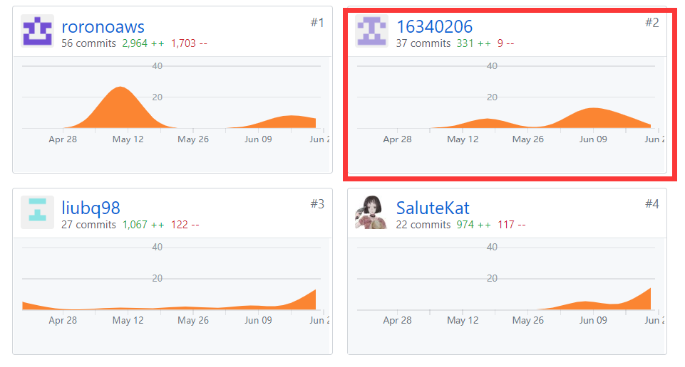
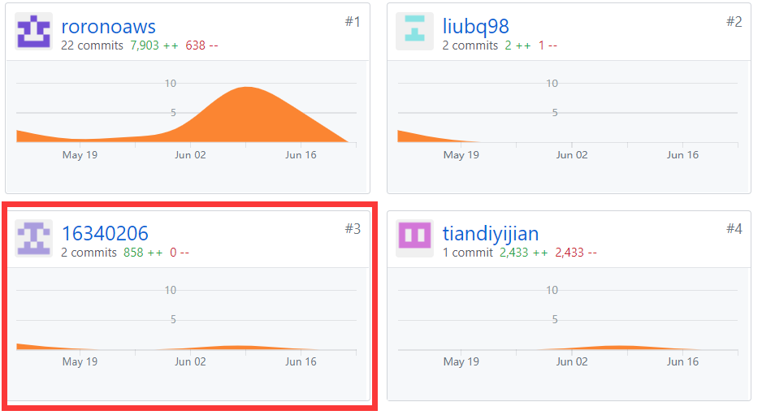

# 16340206-16340206 Final Report

## 个人简短小结

  在此次项目中，我的主要角色是UI设计师与测试工程师，而在项目的前期分工中，我负责编写项目的前端的代码，而项目进行到中期时，由于另一位分配到客户端工作的
大佬进展太快，同时我们之间的交流也不多，导致有部分工作重复了，最后变成了大佬一人完成了客户端的几乎全部内容。我转头开始编写需求规格说明书，同时完成了设计
说明书的部分内容，并在项目的最终阶段对程序进行了测试，同时提出了一些改进意见。

## P2P2.1统计
| PSP 2.1 | Personal Software Process Stages	 | 16340206  |
| :---------------: | :---------------: |:------: | 
|  **Planning**   |     **计划**       | **10**  |  
|  estimate   |    预估任务时间        | 10 |   
|  **Development**   |      **开发**      | **78** |
|   analysis  |    需求分析        | 12 |
|  design spec   |     生成设计文档     | 5 | 
| estimate    |      设计复审（与前端团队成员审核设计文档）      | 2  |  
|  coding standard   |      代码规范      | 4 |
|   design  |     具体设计，包括绘制 UI，设计架构等       | 10 |   
|  coding   |    具体编码        | 30 |
|  code review   |     代码复审       | 5 |  
|  test   |     测试（修改代码）       | 10 |   
|  **Report**   |     **报告**       | **12** |   
|  test report   |     测试报告       | 1 |  
|  size measurement   |       计算工作量     | 2 |  
|   postmortem & process improvement plan  |    每次迭代结束后写总结文档，并提出改进计划  | 9 |   

## 主要工作清单

- 最得意: 参与设计了小程序的用户的登录/注册界面，对微信与小程序的接口部分有了一定的认识;
- 最有功劳: 大部分的模型以及图像都是由我绘制的，同时参与了架构与用例的设计;
- 最有苦劳：几乎没有什么苦劳，最辛苦代码部分几乎被大佬一人承包了，而模型设计这一方面，作为小组成员，努力设计，努力实现都是应该的

## 个人GIT总结：

### Dashboard 文档集合

### Client 客户端

## 个人博客清单
- [16340206-改善项目沟通](https://16340206.github.io/%E6%94%B9%E5%96%84%E9%A1%B9%E7%9B%AE%E6%B2%9F%E9%80%9A)

## 特别致谢：

- 非常感谢大佬roronoaws的辛苦付出，项目的前端、后端、文档都有非常大的贡献，没有他，我们的项目进度可能会非常感人。
- 同时非常感谢小组长liubq98组织，收留我组成了临时的小组，同时很好地组织了小组成员之间的交流，为推动项目进度有着不可磨灭的贡献。
- 此外非常感谢其它小组成员的努力付出，缺少了任何人都无法将项目完成到这一地步。

