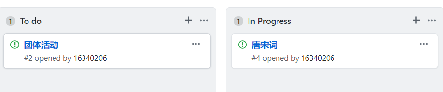
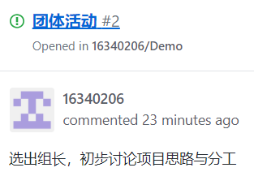
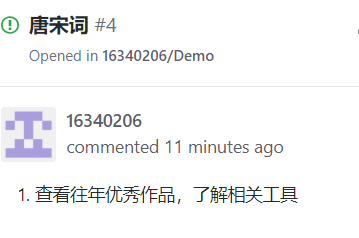

# 软件项目与知识团队管理基础

## 1. 简答题
  + 用简短的语言给出对分析、设计的理解。
  
       分析强调的是对问题和需求的调查研究，而不是解决方案；设计强调的是满足需求的概念上的解决方案（在软件方面和硬件方面），而不是其实现。分析包括了对需要用软件解决的问题的分析，设计是根据分析对软件产品在多方面的设计。
  
  
  + 用一句话描述面向对象的分析与设计的优势。
  
       让分析与设计之间的距离变小，使得我们在进行面向对象的分析与设计时不需要成为“语言专家”。同时提高了软件成品的质量，减小了维护成本。
   
   
  + 简述 UML（统一建模语言）的作用。考试考哪些图？
  
       UML是用于将分析与设计结果可视化的标准构图语言，作为一种建模语言，更加有效的实现了软件工程的要求。将现实世界上的问题转化为了用计算机可以解决的问题。这样方便和统一了问题的建模过程，在对大规模，复杂系统进行建模方面，都有非常好的实践。
       
       UML图包括了
       * 用例图 用例图从用户的角度描述了系统的功能，并指出各个功能的执行者，强调用户的使用者，系统为执行者完成哪些功能。
       * 类图 用户根据用例图抽象成类，描述类的内部结构和类与类之间的关系，是一种静态结构图。
       * 对象图 对象图描述的是参与交互的各个对象在交互过程中某一时刻的状态。可以被看作是类图在某一时刻的实例。
       * 序列图 - 时序图 是交互图的一种，描述了对象之间消息发送的先后顺序，强调时间顺序。
       * 协作图 是交互图的一种，描述了收发消息的对象的组织关系，强调对象之间的合作关系。时序图按照时间顺序布图，而协作图按照空间结构布图
       * 状态图 状态图是一种由状态、变迁、事件和活动组成的状态机，用来描述类的对象所有可能的状态以及时间发生时状态的转移条件。
       * 活动图 活动图是状态图的一种特殊情况，这些状态大都处于活动状态。本质是一种流程图，它描述了活动到活动的控制流。　　　　
       * 构件图 构件图是用来表示系统中构件与构件之间，类或接口与构件之间的关系图。
       * 部署图 描述了系统运行时进行处理的结点以及在结点上活动的构件的配置。强调了物理设备以及之间的连接关系。
       
       考试会考用例图，活动图等，不会考构件图。
       
   + 从软件本质的角度，解释软件范围（需求）控制的可行性
   
      软件的本质决定了软件开发的困难，Brook总结了软件的本质特性为：复杂性（complexity）、一致性（conformity）、可变性（changeability）、不可视性（invisibility）。项目的首要约束是工期、范围、质量和预算四个基本元素，也称为项目管理三角模型。一个项目合约，即是关于四个元素在 理论 上精确的约定。项目管理的任务就是优化调度资源使得这些约束得以满足，且最低的成本。
      
      软件范围多数情况下对于客户和开发者都是模糊的，这形成软件产品与其他产品不同的开发过程，因此，范围管理是软件项目管理的重中之重，对目标系统提出完整、准确、清晰、具体的要求，确定系统必须完成哪些工作，而且需要在合适的时候对业务进行删减。围绕客户目标，发现并满足客户感兴趣的内容，与客户进行了全面的讨论协商，细化20%的具体内容和有效需求后就能够满足客户80%的需求，从而有效控制软件需求。
      
      “先做到，再做好！”。砍去一些客户都没思考清晰的业务，永远是对的。
      
      
## 2. 项目管理实践

  + 看板使用练习（提交看板执行结果贴图，建议使用 Git project）

    
    
    
    
  
  
  + UML绘图工具练习（提交贴图，必须使用 UMLet）
  
  
       
       

