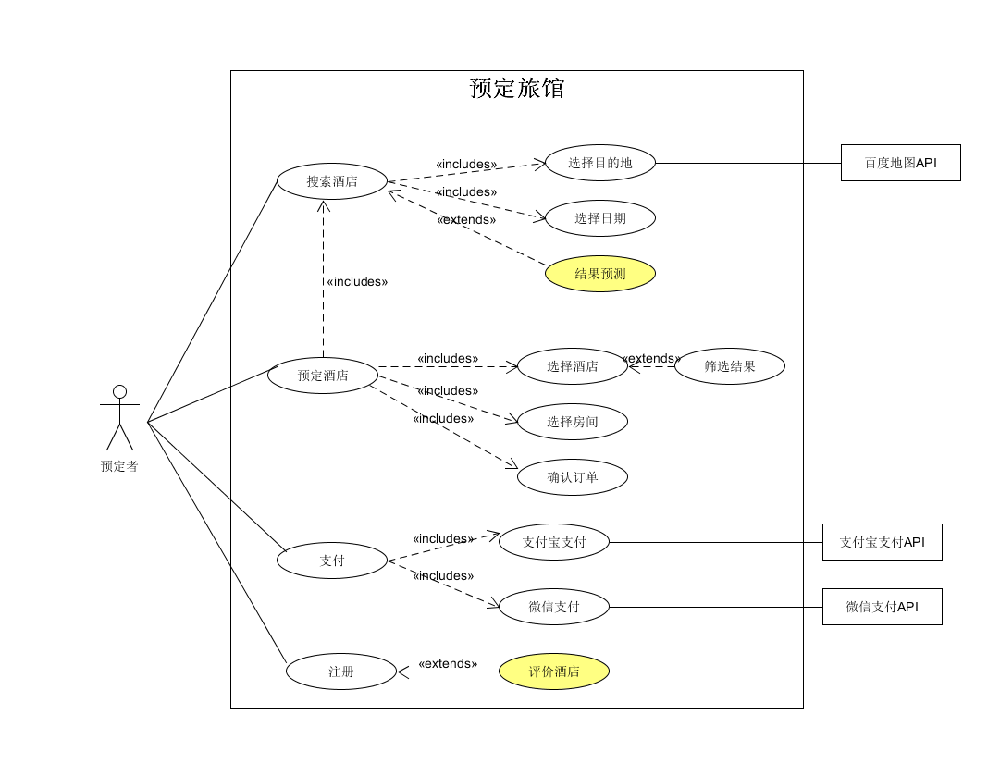
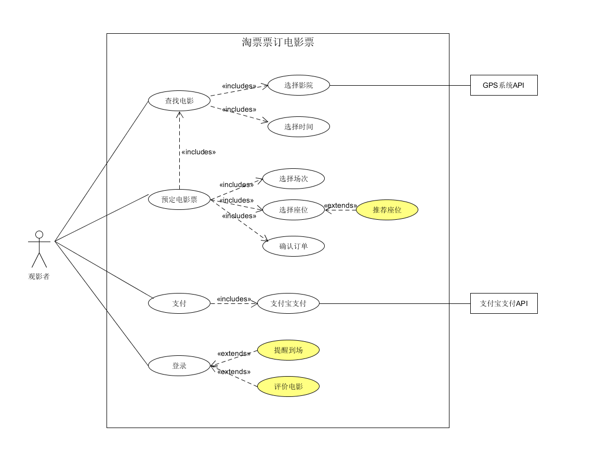

# 用例建模-绘制用例图

## 1. 简答题

   **1. 用例的概念**
 
   答：用例是文本形式的情节描述，广泛应用于需求的发现和记录工作中。通俗地说，用例就是一组相关的成功和失败场景的集合，用来描述参与者是如何使用系统来实现其目标。用例是文档而非图形；用例就是需求，主要是说明系统如何工作的功能性或行为性需求。
 
   **2. 用例和场景的关系？什么是主场景或 happy path？**
 
   答：场景是参与者和系统之间一系列特定的活动和交互，也称为用例实例。场景是使用系统的一个特定情节或用例的一条执行路径。主场景也被称为“理想路径”场景，或更朴实的“基本流程”及“典型流程”。它描述了满足涉众关注点的典型成功路径，与主系统交互，实现用户最简单，最直接目的的场景。happy path 是指在测试用例时没有出现预期之外结果的场景。在用例建模中，happy path的执行者顺利完成了目标
   
   **3. 用例有哪些形式？**
   
   答：用例主要有三种常用形式
   
   + 摘要(brief): 简洁的一段式概要，通常用于主成功场景。
   + 非正式/简便格式(casual): 非正式的段落格式。用几个段落覆盖不同场景。
   + 详述(fully): 详细编写所有步骤及各种变化，同时具有补充部分，如前置条件和成功保证。
   
   **4. 对于复杂业务，为什么编制完整用例非常难？**
   
   答：复杂业务的需求更多，对应的扩展部分内容同样较多，除了主成功场景外的其他场景或分支，成功和失败路径非常多。用例的格式导致编制复杂业务的完整用例十分困难，需要花费大量的时间编写，并且这些用例没有增加或增加很少的价值，同时会导致大量的返工。
   
   **5. 什么是用例图？**
   
   答：用例图是指由参与者（Actor）、用例（Use Case），边界以及它们之间的关系构成的用于描述系统功能的视图。用例图（User Case）是外部用户（被称为参与者）所能观察到的系统功能的模型图。用例图是系统的蓝图。用例图呈现了一些参与者，一些用例，以及它们之间的关系，主要用于对系统、子系统或类的功能行为进行建模。
   
   **6. 用例图的基本符号与元素？**
   
   答：
   + Actor 参与者
   
   + System 系统边界
   
   + Use case 用例
   
   + 关联关系：虚线，箭头指向消息的接受方
   
      * include 虚线 包含关系：箭头指向子节点；
      
      * extends 虚线 扩展关系：箭头指向被扩展的对象；
      
      * 泛化关系：实线箭头，箭头为三角形，指向父用例。
      
   **7. 用例图的画法与步骤**
   
   答：
   1. 确定研讨的系统
   
      + 使用System框表示待研究的系统；
      
      + 正确命名系统或子系统；
      
   2. 识别 Actors
   
      + 识别使用系统的主要参与者（primary actors）/角色(roles)
      + 确定谁使用该系统主要功能，需要该系统的支持以完成其工作；
      + 确定谁维护、管理该系统，保持该系统处于工作状态；
      + 确定谁对本系统结果感兴趣，与本系统有关的人或系统等。
      
   3. 识别用例(服务)
   
      + 特定参与者希望系统提供什么功能；
      + 系统是否存储和检索信息，如果是，由哪个参与者触发；
      + 当系统改变状态时，是否通知参与者；
      + 是否存在影响系统的外部事件，哪个参与者通知系统这些事件。
      
   4. 建立 Actor 和 Use Cases 之间的关联，包括关联、包含、扩展和泛化。
   
   5. 确定外部接口，如API的调用。
   
   **8. 用例图给利益相关人与开发者的价值有哪些？**
   
   答：
   
   + 用例图模拟了参与者和系统之间的通信，并提供了系统使用和行为的摘要视图，此摘要视图提供了对总体需求的直接理解，然后读者可以深入了解特定参与者并使用感兴趣的案例。
    
   + 用例图可以通过显示系统的预期行为来组织需求。
   + 用例图可以有效地总结用户（参与者）与将为企业提供价值的系统之间所需的交互。
   + 用例图以图形方式显示重用用例的机会;此重用处于需求级别，并通过包含和扩展机制在用例图中建模。
   + 用例图可以帮助将大型系统划分为多个模块。每个模块本身可以由用例图表示。
   + 用例图可以促进项目估算，可用于估计项目规模和复杂性，因为它们显示了用例存在的上下文，并与其他用例和参与者相关。
   
   
## 2. 建模练习题（用例模型）
  
  * 选择2-3个你熟悉的类似业务的在线服务系统（或移动 APP），如定旅馆（携程、去哪儿等）、定电影票、背单词APP等，分别绘制它们用例图。并满足以下要求：
  
    + 请使用用户的视角，描述用户目标或系统提供的服务
    + 粒度达到子用例级别，并用 include 和 exclude 关联它们
    + 请用色彩标注出你认为创新（区别于竞争对手的）用例或子用例
    + 尽可能识别外部系统和服务
   
  **定旅馆：**
  
  
  
  **定电影票：** 
  
  
  * 然后，回答下列问题：
  
   1. 为什么相似系统的用例图是相似的？
   2. 如果是定旅馆业务，请对比 Asg_RH 用例图，简述如何利用不同时代、不同地区产品的用例图，展现、突出创新业务和技术
   3. 如何利用用例图定位创新思路（业务创新、或技术创新、或商业模式创新）在系统中的作用
   4. 请使用 SCRUM 方法，选择一个用例图，编制某定旅馆开发的需求（backlog）开发计划表
   5. 根据任务4，参考使用用例点估算软件成本，给出项目用例点的估算
   
   答：
   1. 相似的系统中，用户预期的功能都是相似的，不同的同类系统一定具有一致基本功能以及带有自己特色的扩展功能。例如酒店预订系统中，使用该系统的用户一般需要提供时间、地点、价格等信息，检索出符合信息的房间后预定，酒店预定系统都需要这样的功能，才能够满足用户最基本的需求。因此，相似的系统往往会有相似的功能，也就具有相似的actor、use case和associate，因此也就具有相似的用例图。
   
   2. 不同时代对预定的酒店的需求基本相同。但实现需求的过程中可以有很大的改进，在筛选过程中，可以使用更多的筛选条件以及更好的筛选算法，满足各种不同的主流要求。可以建立更好的用户反馈系统，及时更新相关酒店的评价信息，方便用户选择拥有更多的参考意见。根据不同地区的消费特点不同，可以根据用户的历史订单推荐更符合用户喜好的类型的酒店，并在用例图上突出这些特点。
   
   3. 相似的系统用例图也是相似的，对于一个创新的思路，如一个新的业务模式，往往会产生一个不同的用例图，与传统业务的用例图相比，新的思路是如何对主场景（primary scenario）或者是备用场景（alternate scenario）产生作用的，哪些业务逻辑发生了变化，那些相关的用例发生了改变，对创新部分的用例使用不同颜色进行标注，可以方便开发人员和投资方快速找到核心竞争力及可能带来的结果，便可以定位创新思路在系统中的作用。
   
   4. 编制某定旅馆开发的需求（backlog）开发计划表如下:
   
      | ID            | Title      |  Est   | Iter   | Imp   |   
      |:---------------:|:---------:|:-----:|:----:|:----:|  
      | 10101  | 查找酒店     | 2      | 1  |5|
      | 10102  | 查找城市     | 2      | 4  |4|
      | 10103  | 百度地图API学习     | 5      | 1  |3|
      | 10104  | 支付系统     | 5      | 3  |5|
      | 10111  | 注册系统     | 4      | 2  |4|
       
       
   5. 估算结果如下：
   
   | 用例            | 事务      |  计算   | 原因   | UC权重   |   
   |:---------------:|:---------:|:------:|:-----:|:--------:|  
   | 查找酒店         | 3        | 4       | 基本功能 | 平均    |
   | 查找城市         | 3        | 2       |        | 简单    |
   | 百度地图API学习  | 2        | 1       |        | 简单    |
   | 支付系统         | 3        | 1       | 需要用到外部系统        | 平均    |
   | 注册系统         | 4        | 2       |        | 简单    |

   
   

     

                                                               
