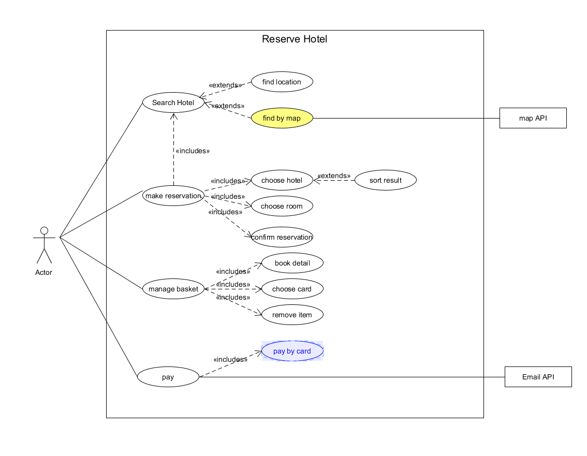
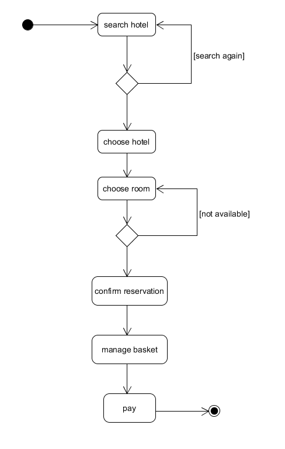
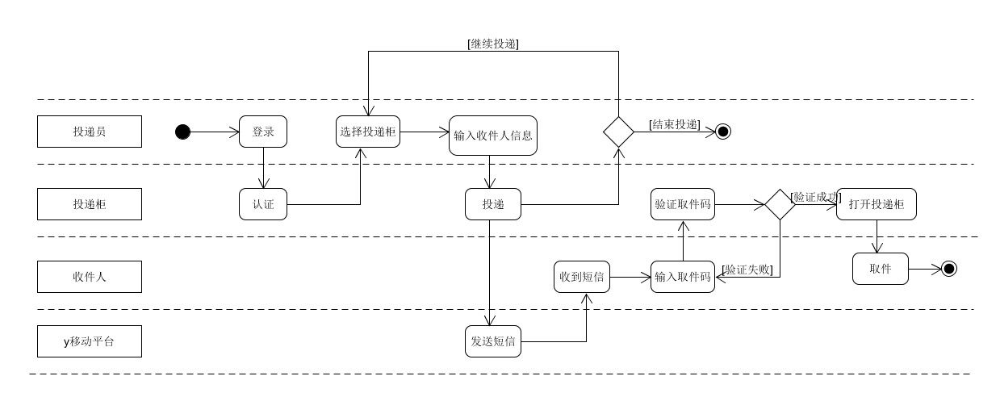
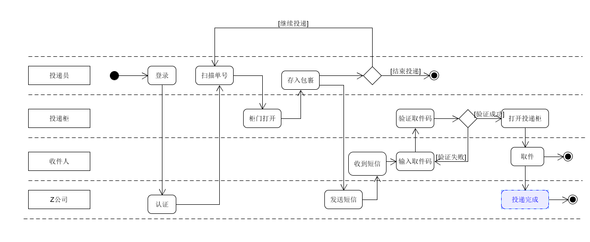

# 用例建模 - 业务建模方法

## 使用 UMLet 建模

**1. 根据订旅馆建模文档，Asg-RH.pdf：**
  + 绘制用例图模型（到子用例）
  
    
  
  + 给出 make reservation 用例的活动图
  
    
    
 **2、根据课程练习“投递员使用投递箱给收件人快递包裹”的业务场景**
  + 分别用多泳道图建模三个场景的业务过程
  
    * 场景1：
    
    
    
    * 场景2：
    
    
  
  
  
  
  
  

